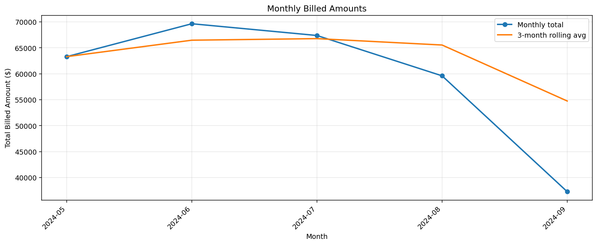
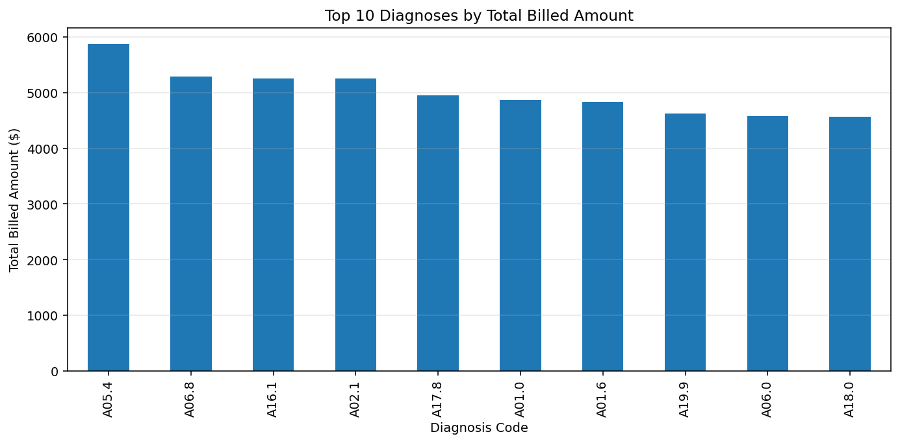
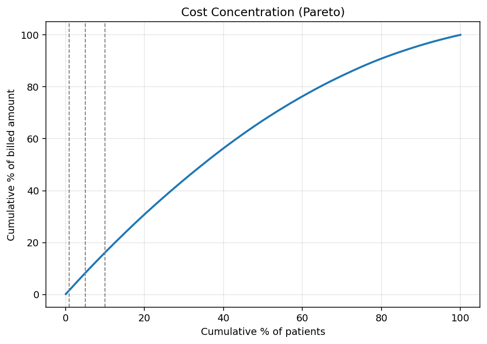

# Healthcare Claims Analysis Project

## Overview

Python-based analysis of synthetic healthcare claims data. Identifies top diagnoses by cost, monthly trends, and insights for healthcare domain.

## Files

- **Healthcare_Claims_Analysis.ipynb**: Main Jupyter notebook with code, visualization, and report. Contains 3 days of analysis:
  - Day 1: Data exploration and shape verification
  - Day 2: Data cleaning and core analysis with visualizations
  - Day 3: Reporting, insights, and demo preparation
- **claim_data.csv**: Synthetic dataset from Kaggle containing healthcare claims records
- **Healthcare_Claims_Analysis.pdf**: Exported report (generate by running the export cell in the notebook)

## How to Run

1. **Install dependencies:**
   ```bash
   pip install pandas numpy matplotlib jupyter
   ```

2. **Run notebook cells sequentially:**
   - Start from the top and execute cells in order
   - Each day builds on previous analysis
   - Visualizations will display inline

3. **Export to PDF (optional):**
   - Run the "Export to PDF" cell in the notebook to generate a shareable PDF report

## Reproducible Pipeline (Recommended)

Run the full analysis end-to-end (data load → integrity checks → clean dataset → tables → figures → report):

```bash
python -m scripts.run_all
```

Deterministic outputs are written to `outputs/`:
- `outputs/data/claims_clean.csv`
- `outputs/tables/missingness.csv`
- `outputs/tables/basic_profile.csv`
- `outputs/tables/kpis_summary.csv`
- `outputs/tables/cost_concentration.csv`
- `outputs/tables/patient_anomalies.csv`
- `outputs/figures/top_dx.png`
- `outputs/figures/monthly_trend.png`
- `outputs/figures/pareto.png`
- `outputs/REPORT.md`

## Key Learnings

- **EDA and Cleaning**: Data quality checks, outlier handling, and missing value treatment
- **Aggregation**: Grouping by diagnosis codes to extract cost insights and trends
- **Visualization**: Using bar and line plots for effective storytelling with data
- **Time-Series Analysis**: Monthly trend identification for healthcare forecasting
- **Domain Knowledge**: Understanding ICD codes, billed amounts, and insurance workflows
- **Deeper Insights & Dashboard**: Added a summary dashboard section with key metrics and bullet insights for quick executive review.
- **Cost Concentration Analysis**: Calculated the percentage of total costs contributed by the top 10 patients, revealing cost distribution patterns.
- **ICD Code Mapping**: Mapped common ICD codes to human-readable descriptions for better interpretability in outputs and reports.
- **Anomaly Detection**: Flags unusually high-cost patients using a z-score on patient total billed (results saved to `outputs/tables/patient_anomalies.csv`).

## Project Scope

Built as a 3-day structured project for portfolio demonstration and interview prep. Showcases healthcare analytics capabilities valuable in data analytics, business intelligence, and health tech roles.

## Technologies Used

- **Pandas**: Data manipulation and analysis
- **NumPy**: Numerical computing
- **Matplotlib**: Data visualization
- **Jupyter**: Interactive notebook environment

## Visualizations

### Distribution Analysis
These figures are generated by the pipeline and saved under `outputs/figures/`.







### Tables (Source of Truth)

All KPI values and claims in this project should be taken from the generated tables:
- `outputs/tables/kpis_summary.csv` (one-row KPI summary)
- `outputs/tables/cost_concentration.csv` (top 1% / 5% / 10% patient cost share)
- `outputs/tables/missingness.csv` and `outputs/tables/basic_profile.csv` (auditability)
- `outputs/tables/patient_anomalies.csv` (high-cost patient flags, may be empty on synthetic data)

## Methodology

This section describes how the pipeline computes each KPI (see `outputs/tables/kpis_summary.csv`).

- **Cleaning rules**: Parse `Date of Service` (if present). Drop rows with missing `Billed Amount` and keep `Billed Amount > 0`.
- **Total billed amount**: Sum of `Billed Amount` across all rows after cleaning.
- **Average/median/p95 claim amount**: Computed on the cleaned `Billed Amount` distribution.
- **Unique patients**: `nunique(Patient ID)` when a patient/member id column is available.
- **Top diagnosis**: Group by diagnosis code (e.g., `Diagnosis Code`) and take the code with the highest total billed amount.
- **Date range**: Min/max of parsed `Date of Service`.
- **Member-months & PMPM (if date + member exist)**: Count distinct (member, month) pairs, then compute $\text{PMPM}=\frac{\text{total billed}}{\text{member-months}}$.
- **Cost concentration (Pareto)**: Aggregate to patient total billed, sort descending, then compute the share of total cost attributed to the top 1% / 5% / 10% of patients (saved to `outputs/tables/cost_concentration.csv`).
- **Anomaly detection**: Compute patient total billed and flag patients with z-score $\ge 3.0$ (saved to `outputs/tables/patient_anomalies.csv`). If none are flagged, the distribution is likely too bounded/uniform (common in synthetic data).

## Future Enhancements

- Add HIPAA compliance considerations for real data
- Scale analysis with SQL or Spark for larger datasets
- Integrate predictive modeling for cost forecasting
- Create interactive dashboards with Plotly or Tableau
