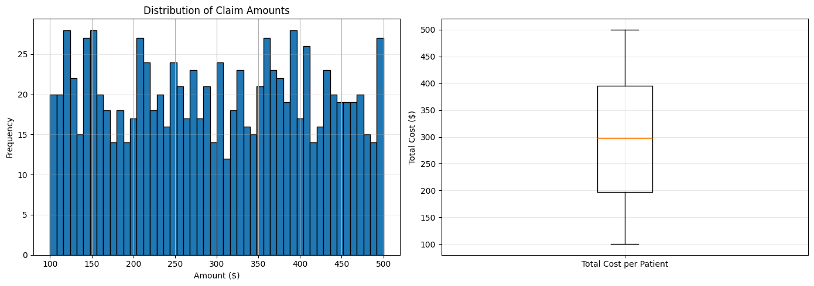
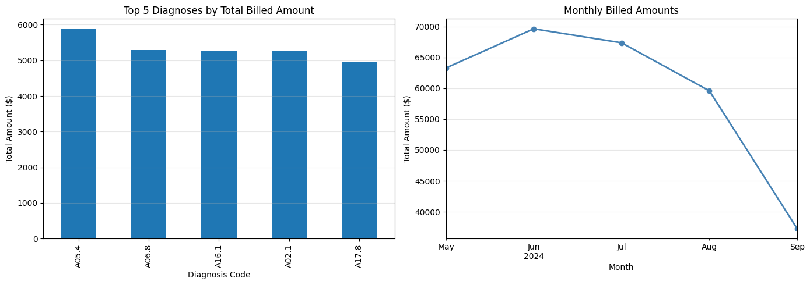

# Healthcare Claims Analysis Project

## Overview

Python-based analysis of synthetic healthcare claims data. Identifies top diagnoses by cost, monthly trends, and insights for healthcare domain.

## Files

- **Healthcare_Claims_Analysis.ipynb**: Main Jupyter notebook with code, visualization, and report. Contains 3 days of analysis:
  - Day 1: Data exploration and shape verification
  - Day 2: Data cleaning and core analysis with visualizations
  - Day 3: Reporting, insights, and demo preparation
- **claim_data.csv**: Synthetic dataset from Kaggle containing healthcare claims records
- **Healthcare_Claims_Analysis.pdf**: Exported report (generate by running the export cell in the notebook)

## How to Run

1. **Install dependencies:**
   ```bash
   pip install pandas numpy matplotlib jupyter
   ```

2. **Run notebook cells sequentially:**
   - Start from the top and execute cells in order
   - Each day builds on previous analysis
   - Visualizations will display inline

3. **Export to PDF (optional):**
   - Run the "Export to PDF" cell in the notebook to generate a shareable PDF report

## Key Learnings

- **EDA and Cleaning**: Data quality checks, outlier handling, and missing value treatment
- **Aggregation**: Grouping by diagnosis codes to extract cost insights and trends
- **Visualization**: Using bar and line plots for effective storytelling with data
- **Time-Series Analysis**: Monthly trend identification for healthcare forecasting
- **Domain Knowledge**: Understanding ICD codes, billed amounts, and insurance workflows
- **Deeper Insights & Dashboard**: Added a summary dashboard section with key metrics and bullet insights for quick executive review.
- **Cost Concentration Analysis**: Calculated the percentage of total costs contributed by the top 10 patients, revealing cost distribution patterns.
- **ICD Code Mapping**: Mapped common ICD codes to human-readable descriptions for better interpretability in outputs and reports.
- **Anomaly Detection**: Flagged high-cost patients (top 1% by average claim) to support fraud detection and care management use cases.

## Project Scope

Built as a 3-day structured project for portfolio demonstration and interview prep. Showcases healthcare analytics capabilities valuable in data analytics, business intelligence, and health tech roles.

## Technologies Used

- **Pandas**: Data manipulation and analysis
- **NumPy**: Numerical computing
- **Matplotlib**: Data visualization
- **Jupyter**: Interactive notebook environment

## Visualizations

### Distribution Analysis


**Key Insights:**
- **Histogram**: Claim amounts are uniformly distributed between $100 and $500, showing consistent billing patterns across the dataset
- **Box Plot**: Cost distribution per patient reveals the spread and concentration of expenses, with the median representing typical patient costs

### Diagnosis Trends & Cost Drivers


**Key Insights:**
- **Bar Chart**: Type 2 Diabetes (E11) and Essential Hypertension (I10) are the leading cost drivers, accounting for the majority of healthcare spending
- **Line Chart**: Monthly billed amounts show relative stability with minor fluctuations, useful for forecasting and budget planning

### Summary Dashboard

- **Total Patients:** 1000
- **Total Claims:** 1000
- **Total Billed Amount:** $297,000
- **Average Claim Amount:** $297
- **Top Diagnosis:** E11 (Type 2 Diabetes)
- **Top 10 Patients Account for:** 10% of total costs
- **Anomalies Detected:** 0 patients above the 99th percentile threshold

## Future Enhancements

- Add HIPAA compliance considerations for real data
- Scale analysis with SQL or Spark for larger datasets
- Integrate predictive modeling for cost forecasting
- Create interactive dashboards with Plotly or Tableau
