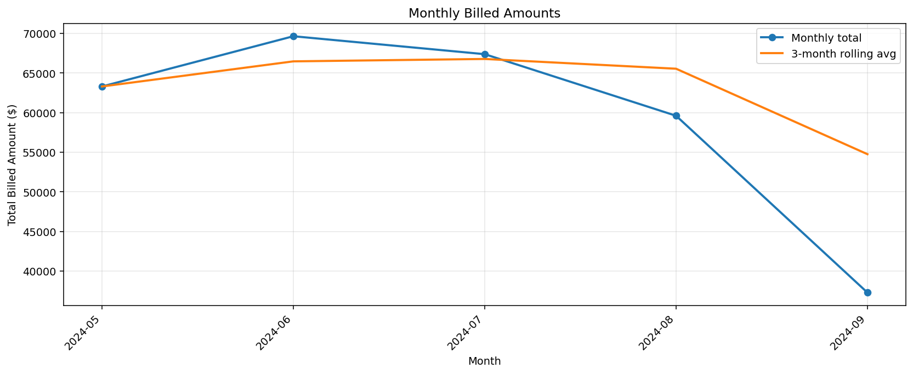
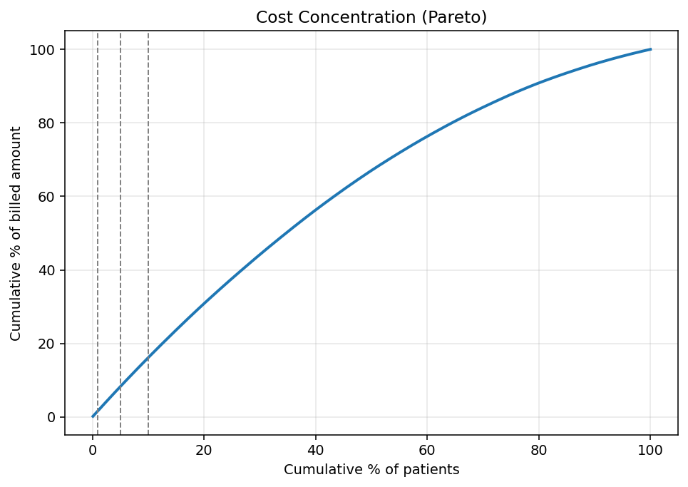
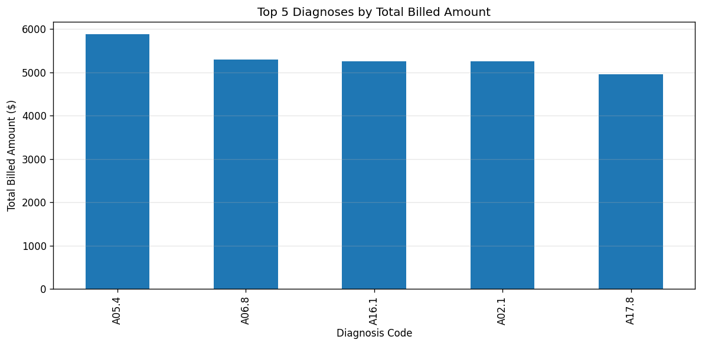
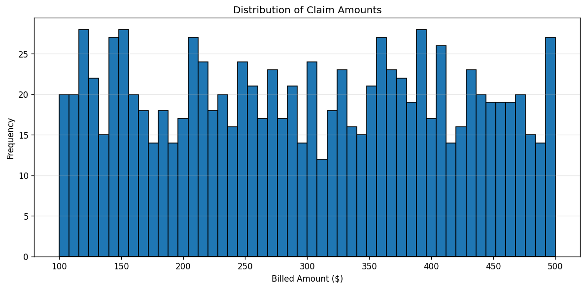
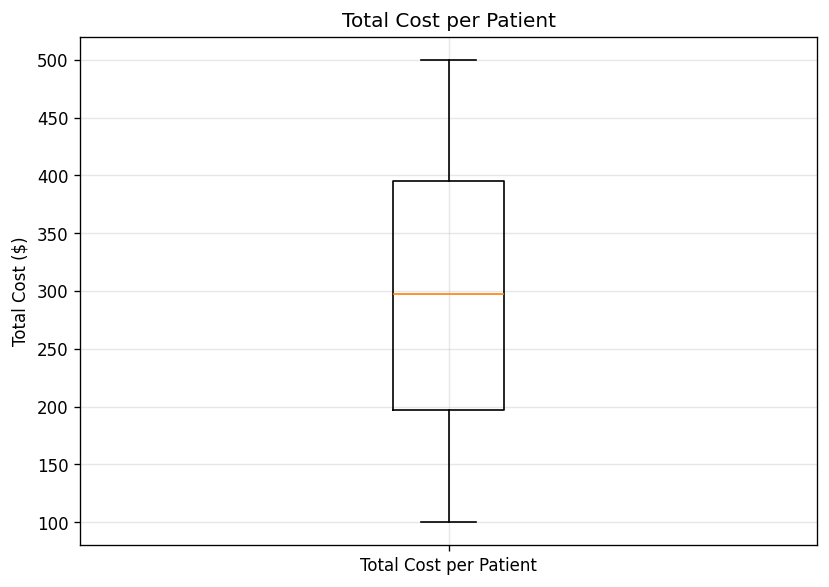
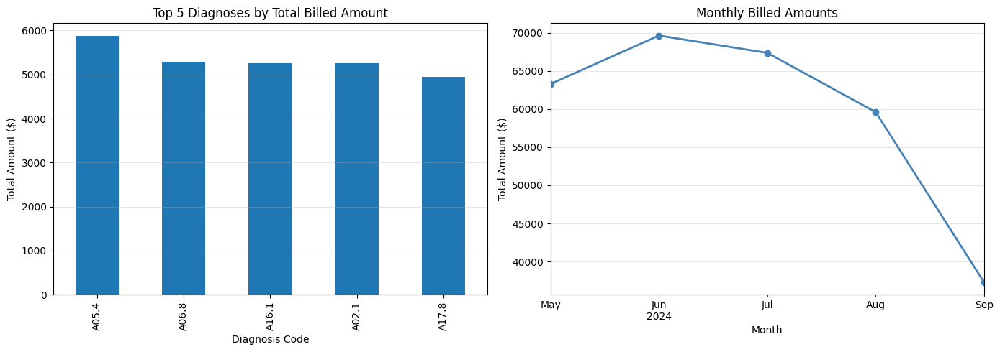

# 🏥 Healthcare Claims Analysis

> **End-to-end Python analytics pipeline** — data validation → KPI reporting → Pareto insights → auto-generated figures, decision memo, and data dictionary.


---

## 🔍 Project Overview

This project demonstrates a **production-style analytics pipeline** applied to 1,000 synthetic healthcare claims records. The goal: surface cost drivers, identify high-risk patient cohorts, and generate audit-ready documentation — entirely from code.

**Skills demonstrated:**
- 🧹 Data quality & validation (missingness, range checks, uniqueness)
- 📊 KPI computation & Pareto analysis
- 📈 Time-series trend analysis
- 🏗️ Modular, reusable pipeline architecture
- 📝 Auto-generated documentation (no hand-typed numbers)

---

## 📊 Key Visualizations

### Monthly Billing Trend
*Tracks total billed amounts over the analysis period to surface seasonal or volume patterns.*



---

### Pareto Analysis — Cost Concentration
*Visualizes how cost is distributed across the patient population. A classic Pareto lens used in population health management.*



---

### Top Diagnoses by Total Billed
*Identifies the highest-cost diagnostic codes to prioritize clinical intervention programs.*



---

### Claim Amount Distribution
*Histogram showing the spread of individual claim values — highlights skew and outlier risk.*



---

### Patient Cost Spread (Box Plot)
*Box plot of total per-patient costs — visualizes median, IQR, and outlier thresholds used in anomaly detection.*



---

### Diagnosis Trends Over Time
*Tracks how top ICD codes trend across the time window.*



---

## 📈 Results Summary

| Metric | Value |
|---|---|
| Total Claims | 1,000 |
| Total Billed | **$297,191.00** |
| Unique Patients | 1,000 |
| Average Claim | $297.19 |
| Median Claim | $297.00 |
| P95 Claim | $480.00 |
| PMPM Billed | $297.19 |
| Unique Diagnoses | 100 |
| Top Diagnosis | A05.4 ($5,872 · 1.98% of spend) |
| Date Range | 2024-05-01 → 2024-09-20 |

### Cost Concentration (Pareto)

| Patient Tier | % of Total Cost |
|---|---|
| Top 1% | 1.68% |
| Top 5% | 8.25% |
| Top 10% | **16.12%** |

> 💡 **Insight:** The top 10% of patients drive 16% of total spend — targeted care management for this cohort represents the highest ROI intervention opportunity.

---

## ⚡ Quickstart

```bash
# 1. Install dependencies
pip install -r requirements.txt

# 2. Run the full pipeline end-to-end
python -m scripts.run_all
```

**Pipeline outputs:**
| Output | Location |
|---|---|
| Clean dataset | `outputs/data/claims_clean.csv` |
| KPI & analysis tables | `outputs/tables/*.csv` |
| Figures | `outputs/figures/*.png` |
| Report | `outputs/REPORT.md` |
| Decision memo | `docs/decision_memo.md` |
| Data dictionary | `docs/data_dictionary.md` |

---

## 🏗️ Pipeline Architecture

```
claim_data.csv
      │
      ▼
[Quality Checks]  ──  src/claims/quality.py
      │                (missingness, ranges, uniqueness)
      ▼
[Clean & Enrich]  ──  scripts/run_all.py
      │
      ▼
[Metrics & KPIs]  ──  src/claims/metrics.py
      │                (KPIs, Pareto, anomalies, trends)
      ▼
[Render Outputs]  ──  scripts/render_*.py
      │                (auto-generated docs — no manual edits)
      ▼
outputs/  +  docs/
```

**Design principles:**
- **Reproducible** — every number in every doc traces back to pipeline output
- **Modular** — quality, metrics, and rendering are independently testable
- **Auditable** — no hardcoded values; re-run pipeline to update all docs

---

## 📁 Repository Structure

```
healthcare-claims-analysis/
├── claim_data.csv                  # Synthetic input dataset
├── src/claims/
│   ├── quality.py                  # Data validation checks
│   └── metrics.py                  # KPI & analysis computations
├── scripts/
│   ├── run_all.py                  # Full pipeline orchestrator
│   ├── render_readme.py            # Auto-generates README tables
│   ├── render_decision_memo.py     # Auto-generates decision memo
│   └── gen_data_dictionary.py      # Auto-generates data dictionary
├── outputs/
│   ├── figures/                    # All generated charts (PNG)
│   ├── tables/                     # All generated tables (CSV)
│   └── REPORT.md
├── docs/
│   ├── decision_memo.md            # Findings & recommendations
│   └── data_dictionary.md          # Column definitions
├── visualizations/                 # Additional exploratory charts
├── tests/                          # Unit tests
└── Healthcare_Claims_Analysis.ipynb  # Exploratory notebook
```

---

## 💡 Key Insights

- **Top 10% of patients** drive 16.1% of total cost — disease management targeting this cohort could yield significant ROI.
- **Diagnosis A05.4** is the #1 cost driver at 1.98% of total spend — a prevention/management program is the highest-impact clinical lever.
- **No statistical outliers** detected (z-score ≥ 3.0) in this synthetic dataset — the distribution is intentionally uniform, unlike real-world claims which typically show extreme concentration.

---

## 🔬 Methodology & Docs

| Document | Description |
|---|---|
| [Decision Memo](docs/decision_memo.md) | Findings, "so what" analysis, and recommended actions |
| [Data Dictionary](docs/data_dictionary.md) | Column definitions, types, and assumptions |
| [Notebook](Healthcare_Claims_Analysis.ipynb) | Exploratory analysis (legacy reference) |
| [HTML Report](Healthcare_Claims_Analysis.html) | Rendered notebook for browser viewing |

---

## 🛠️ Technologies

| Tool | Purpose |
|---|---|
| **Python 3.10+** | Core language |
| **pandas** | Data wrangling & aggregation |
| **numpy** | Numerical computing |
| **matplotlib** | Chart generation |
| **Jupyter** | Exploratory analysis |

---

## ⚙️ Regenerate Docs Only

If analysis outputs already exist and you only need to re-render documentation:

```bash
python scripts/render_readme.py \
  --kpis outputs/tables/kpis_summary.csv \
  --cost-concentration outputs/tables/cost_concentration.csv \
  --output README.md

python scripts/render_decision_memo.py \
  --kpis outputs/tables/kpis_summary.csv \
  --cost-concentration outputs/tables/cost_concentration.csv \
  --anomalies outputs/tables/patient_anomalies.csv \
  --output docs/decision_memo.md

python scripts/gen_data_dictionary.py \
  --input outputs/data/claims_clean.csv \
  --output docs/data_dictionary.md
```

---

## ⚠️ Limitations

- **Synthetic data** — patterns reflect a uniform distribution, not real-world claims. Results should be validated against actual claims before acting.
- **Scope** — no clinical outcomes, provider performance, or member demographics are included.
- **Temporal** — fixed date range only; seasonal or multi-year trends require rolling re-analysis.

---

## 📄 License

MIT — see [LICENSE](LICENSE) for details.
